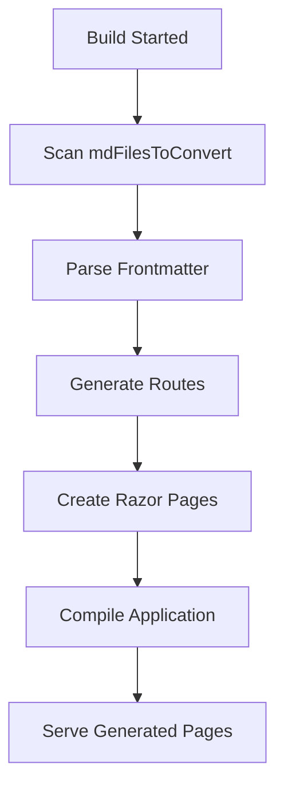

# Feature Showcase

This page demonstrates **advanced frontmatter configuration** and how it affects the generated Razor page.

## Frontmatter Configuration

This page uses the following frontmatter:

```yaml
---
route: /features
title: Amazing Features
description: Discover the powerful features of our Markdown to Razor code generation system
showTitle: true
tags:
  - CodeGeneration
  - Blazor
  - Markdown
  - Build
---
```

## What This Enables

### Custom Routing

Instead of the default `/feature-showcase` route (from filename), this page uses `/features`.

### SEO Optimization

The `description` field automatically generates a meta description tag:

```html
<meta name="description" content="Discover the powerful features..." />
```

### Tagging System

The `tags` array creates a visual tag display at the bottom of the page.

### Title Control

The `showTitle` property controls whether the H1 title is displayed.

## Advanced Features

### Code Generation Pipeline

Our build-time code generation follows this process:



### Supported Frontmatter Options

| Property      | Type     | Default        | Description                    |
| ------------- | -------- | -------------- | ------------------------------ |
| `route`       | string   | `/{filename}`  | Custom route for the page      |
| `title`       | string   | Auto-generated | Page title and H1 heading      |
| `description` | string   | None           | SEO meta description           |
| `showTitle`   | boolean  | `true`         | Whether to display H1 title    |
| `layout`      | string   | Default        | Custom layout (future feature) |
| `tags`        | string[] | None           | Page tags for categorization   |

### Real-World Examples

#### Blog Post

```yaml
---
route: /blog/my-post
title: My Awesome Blog Post
description: Learn about the latest updates in our project
tags: [blog, updates, news]
---
```

#### Documentation Page

```yaml
---
route: /docs/api/users
title: User API Reference
description: Complete API documentation for user management
showTitle: false
tags: [api, documentation, users]
---
```

#### Landing Page

```yaml
---
route: /
title: Welcome to Our App
description: The best markdown to Razor conversion tool available
tags: [home, welcome]
---
```

## Performance Benefits

### Build-Time Generation

- ✅ **Zero Runtime Overhead**: Pages are pre-generated during build
- ✅ **Fast Page Loads**: No markdown processing during requests
- ✅ **SEO Friendly**: Full HTML available for indexing
- ✅ **Static Analysis**: Full IntelliSense and compile-time checking

### Developer Experience

- ✅ **Content-First**: Write in markdown, get Blazor pages
- ✅ **Hot Reload**: Changes trigger automatic regeneration
- ✅ **Version Control**: Generated pages are tracked and diffable
- ✅ **Type Safety**: Full C# compiler validation

## Integration Examples

### CI/CD Pipeline

```yaml
# GitHub Actions example
- name: Build with Code Generation
  run: |
    dotnet build
    # Pages automatically generated during build

- name: Deploy
  run: |
    dotnet publish -c Release
    # Generated pages included in deployment
```

### Development Workflow

```bash
# 1. Create markdown file
echo "# New Page" > mdFilesToConvert/new-page.md

# 2. Build (triggers generation)
dotnet build

# 3. Page available at /new-page
dotnet run
```

---

**Note**: This page showcases advanced frontmatter features. Check the bottom for the generated tag display!
